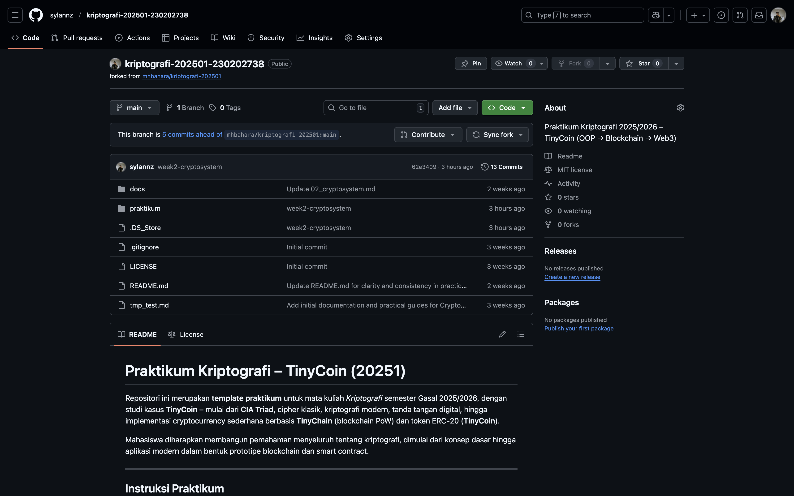
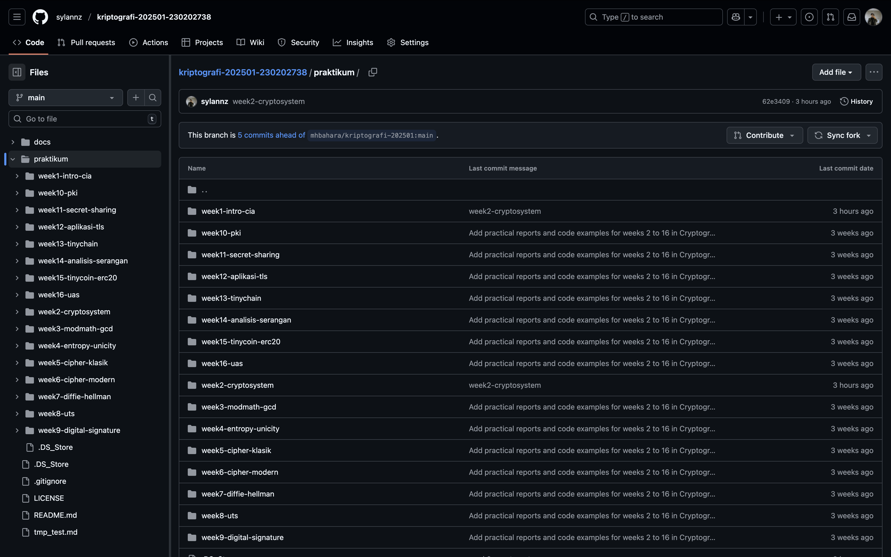

# Laporan Praktikum Kriptografi

Minggu ke-: 1
Topik: Sejarah Kriptografi & Prinsip CIA
Nama: Asmoko Khusnul Tri Maulana  
 NIM: 230202738  
 Kelas: 5IKRB

---

## 1. Tujuan

Menjelaskan sejarah dan evolusi kriptografi dari masa klasik hingga modern.
Menyebutkan prinsip Confidentiality, Integrity, and Availability (CIA) yang benar.
Menyimpan peran kriptografi dalam sistem keamanan informasi modern.
Menyiapkan repositori GitHub sebagai media kerja praktikum.

## 2. Dasar Teori

Kriptografi adalah ilmu dan seni untuk menjaga keamanan pesan dengan cara menyandingkannya ke dalam bentuk yang tidak dimengerti tanpa pengetahuan khusus. Sejarahnya terbagi menjadi dua era utama: klasik dan modern. Kriptografi klasik, seperti Caesar Cipher dan Vigenere Cipher, beroperasi pada tingkat huruf dan mengandalkan kerahasiaan algortima. Metode ini rentan terhadap analisis frekuensi dan pola bahasa.

Perkembangan bealih ke kriptografi modern setelah era Perang Dunia II, yang ditandai dengan pengguna komputer dan dasar matematika yang kuat. Algoritma modern seperti AES (Advanced Encryption Standard) dan RSA (Rivest-Shamir-Adleman) bekerja pada level bit data, bukan karakter. Kriptografi modern sangat bergantung pada kerahasiaan kunci, bukan algoritma. Konsep ini menjadi fondasi bagi keamanan informasi modern, yang ditegakkan melalui tiga pilar utama yang dikenal sebagai CIA Triad: Confidentiality, Integrity, dan Availability.

---

## 3. Alat dan Bahan

Laptop
Visual Studio Code
Git dan akun GitHub

---

## 4. Langkah Percobaan

Langkah-langkah yang dilakukan pada praktikum minggu pertama ini adalah sebagai berikut:

1. Melakukan fork.
2. Mengubah nama repositori hasil fork.
3. Melakukan clone repositori tersebut ke komputer lokal.
4. Membuat struktur folder baru di dalam repositori lokal.
5. Di dalam folder tersebut, membuat laporan.md dan sebuah folder screenshot/.
6. Menulis ringkasan mengenai sejarah kriptografi dan prinsip CIA di dalam file laporan.md.
7. Menjawab pertanyaan kuis yang diberikan pada modul.
8. Menambahkan file laporan dan screenshot ke Git, lalu melakukan commit dengan pesan week1-intro-cia dan push ke GitHub.

---

## 5. Source Code

Pada praktikum minggu ini tidak ada pembuatan atau modifikasi source code progaram. Kegiatan berfokus pada penyiapan lingkungan kerja dan pembuatan laporan.

---

## 6. Hasil dan Pembahasan

Repositori GitHub berhasil disiapkan sesuai dengan panduan. Struktur folder dan file laporan telah dibuat. Ringkasan materi dan jawaban kuis telah diselesaikan di dalam laporan ini. Hasilnya sesuai dengan ekspektasi dari tujuan praktikum, di mana lingkungan kerja untuk praktikum selanjutnya telah siap digunakan. Tidak ada error yang ditemui selama proses penyiapan.

Bukti ScreenShoot:




---

## 7. Jawaban Pertanyaan

1. Claude Shannon dianggap sebagai bapak kriptografi modern karena karyanya dalam teori informasi ("A Mathematical Theory of Communication") yang meletakkan dasar matematis untuk kriptografi dan kriptoanalisis.
2. Algoritma kunci publik yang populer digunakan saat ini antara lain RSA, Diffie-Hellman, dan Elliptic Curve Cryptography (ECC).
3. Perbedaan utama antara kriptografi klasik dan modern adalah:
   Basis Operasi: Kriptografi klasik beroperasi pada karakter (huruf), sedangkan kriptografi modern beroperasi pada data biner (bit).
   Kunci dan Algoritma: Keamanan kriptografi klasik seringkali bergantung pada kerahasiaan algoritmanya, sementara kriptografi modern mengandalkan kerahasiaan kunci, bukan algoritmanya (Prinsip Kerckhoffs).
   Kompleksitas: Kriptografi klasik menggunakan operasi sederhana seperti substitusi dan transposisi. Kriptografi modern menggunakan prinsip matematika yang sangat kompleks.

---

## 8. Kesimpulan

Praktikum minggu pertama berhasil diselesaikan dengan penyiapan repositori GitHub sebagai lingkungan kerja dan pemahaman konsep dasar mengenai sejarah kriptografi serta pilar keamanan informasi CIA. Fondasi ini penting sebagai bekal untuk mengikuti kegiatan praktikum pada minggu-minggu berikutnya yang akan membahas implementasi algoritma kriptografi.

---

## 9. Daftar Pustaka

---

## 10. Commit Log

```
commit 0dfc99ddc847a60a3bd05bab32e0f5cd8ba8c034
Author: Asmoko Khusnul Tri Maulana <maulana.asmoko@gmail.com>
Date:   2025-10-09

    week1-intro-cia
```
