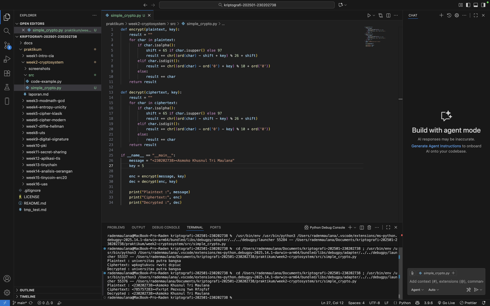
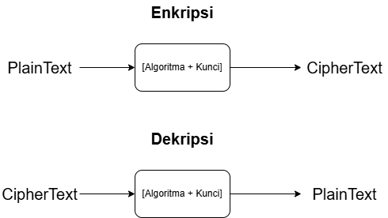

# Laporan Praktikum Kriptografi

Minggu ke-: 2
Topik: Cryptosystem (Komponen, Enkripsi & Dekripsi, Simetris & Asimetris)
Nama: Asmoko Khusnul Tri Maulana
NIM: 230202738
Kelas: 5IKRB

---

## 1. Tujuan

Memahami komponen-komponen dasar yang membentuk sebuah kriptosistem.
Mampu mengimplementasikan algoritma enkripsi-dekripsi sederhana.
Memahami perbedaan fundamental, kelebihan, dan kelemahan sistem simetris dan asimetris.
Menganalisis masalah utama dalam sistem kriptografi, seperti distribusi kunci.

---

## 2. Dasar Teori

Kriptografi adalah ilmu dan seni untuk menjaga keamanan pesan. Sebuah sistem kriptografi atau kriptosistem terdiri dari serangkaian algoritma dan protokol untuk mengamankan komunikasi. Salah satu bentuk kriptografi paling awal adalah cipher klasik seperti Caesar Cipher, yang merupakan substitution cipher di mana setiap huruf digantikan oleh huruf lain berdasarkan kunci pergeseran. Meskipun sederhana, ia menjadi dasar untuk memahami konsep kunci, enkripsi, dan dekripsi.

Secara umum, kriptografi modern terbagi menjadi dua kategori utama berdasarkan cara penggunaan kuncinya: simetris dan asimetris.

Kriptografi Simetris (Private Key Cryptography)
Dalam sistem ini, satu kunci rahasia (private key) yang sama digunakan untuk proses enkripsi dan dekripsi. Pengirim dan penerima harus memiliki kunci yang identik sebelum berkomunikasi. Karena proses komputasinya yang sederhana, algoritma ini sangat cepat dan efisien untuk mengenkripsi data dalam jumlah besar. Tantangan utamanya adalah bagaimana cara membagikan kunci rahasia ini secara aman (masalah distribusi kunci).
Contoh Algoritma Simetris:
a. AES (Advanced Encryption Standard): Standar industri saat ini yang dianggap sangat aman dan efisien. AES digunakan secara luas di berbagai aplikasi, mulai dari keamanan Wi-Fi (WPA2/WPA3) hingga enkripsi database.
b. DES (Data Encryption Standard): Standar yang lebih tua. Karena panjang kuncinya yang pendek (56-bit), DES sudah dianggap tidak aman untuk aplikasi modern karena rentan terhadap serangan brute-force.
Kriptografi Asimetris (Public Key Cryptography)
Sistem ini menggunakan sepasang kunci yang saling berhubungan secara matematis: kunci publik (public key) dan kunci privat (private key).
a. Kunci Publik: Dapat dibagikan secara bebas. Digunakan untuk mengenkripsi pesan.
b. Kunci Privat: Harus dijaga kerahasiaannya oleh pemilik. Digunakan untuk mendekripsi pesan.
Pesan yang dienkripsi dengan kunci publik seseorang hanya bisa didekripsi oleh kunci privat pasangannya. Sistem ini memecahkan masalah distribusi kunci, namun proses komputasinya jauh lebih lambat dibandingkan kriptografi simetris.
Contoh Algoritma Asimetris:
a. RSA (Rivest-Shamir-Adleman): Salah satu algoritma asimetris pertama dan paling terkenal. Keamanannya didasarkan pada kesulitan matematis untuk memfaktorkan bilangan prima yang sangat besar. RSA banyak digunakan untuk tanda tangan digital dan pertukaran kunci aman (misalnya dalam protokol TLS/SSL).
b. ECC (Elliptic Curve Cryptography): Alternatif modern untuk RSA yang menawarkan tingkat keamanan yang sama dengan panjang kunci yang jauh lebih pendek. Ini membuatnya sangat efisien untuk perangkat dengan sumber daya terbatas, seperti smartphone.

---

## 3. Alat dan Bahan

Python 3.13
Visual Studio Code
Git dan akun GitHub

---

## 4. Langkah Percobaan

Membuat direktori baru dengan nama week2-cryptosystem di dalam repositori praktikum.
Membuat file simple_crypto.py di dalam sub-direktori src/.
Menuliskan kode program untuk implementasi Caesar Cipher yang mencakup fungsi enkripsi dan dekripsi.
Menambahkan fungsi main untuk interaksi dengan pengguna, yang memungkinkan input teks, kunci, dan pilihan mode (enkripsi atau dekripsi).
Menjalankan program dari terminal dengan perintah python src/simple_crypto.py.
Melakukan beberapa pengujian dengan pesan dan kunci yang berbeda untuk memverifikasi fungsionalitas program.
Mengambil screenchot dari hasil eksekusi program untuk dilampirkan dalam laporan.

---

## 5. Source Code

def encrypt(plaintext, key):
result = ""
for char in plaintext:
if char.isalpha():
shift = 65 if char.isupper() else 97
result += chr((ord(char) - shift + key) % 26 + shift)
elif char.isdigit():
result += chr((ord(char) - ord('0') + key) % 10 + ord('0'))
else:
result += char
return result

def decrypt(ciphertext, key):
result = ""
for char in ciphertext:
if char.isalpha():
shift = 65 if char.isupper() else 97
result += chr((ord(char) - shift - key) % 26 + shift)
elif char.isdigit():
result += chr((ord(char) - ord('0') - key) % 10 + ord('0'))
else:
result += char
return result

if **name** == "**main**":
message = "<230202738><Asmoko Khusnul Tri Maulana>"
key = 5

    enc = encrypt(message, key)
    dec = decrypt(enc, key)

    print("Plaintext :", message)
    print("Ciphertext:", enc)
    print("Decrypted :", dec)

---

## 6. Hasil dan Pembahasan

Program Caesar Cipher berhasil diimplementasikan sesuai dengan tujuan praktikum. Pengujian fungsionalitas dilakukan dengan beberapa skenario input untuk memvalidasii proses enkripsi dan dekripsi. Hasilnya disajikan dalam tabel berikut:

| Plaintext                            | Kunci |  Mode  | Hasil Program                        | Status |
| :----------------------------------- | :---: | :----: | :----------------------------------- | :----- |
| 230202738 Asmoko Khusnul Tri Maulana |   5   | enkrip | 785757283 Fxrtpt Pmzxszq Ywn Rfzqfsf | Sesuai |
| 785757283 Fxrtpt Pmzxszq Ywn Rfzqfsf |   5   | dekrip | 230202738 Asmoko Khusnul Tri Maulana | Sesuai |

Seperti yang ditunjukkan pada tabel, program berjalan tanpa error dan memberikan output yang benar sesuai dengan prinsip kerja Caesar Cipher.




---

## 7. Jawaban Pertanyaan

Komponen utama dalam sebuah kriptosistem terdiri dari plaintext (data asli), ciphertext (data yang telah dienkripsi), algoritma enkripsi dan dekripsi, serta kunci (key) yang digunakan dalam proses transformasi data. Enkripsi mengubah plaintext menjadi ciphertext menggunakan algoritma dan kunci, sedangkan dekripsi mengembalikan ciphertext menjadi plaintext dengan kunci yang sesuai. Sistem kriptografi simetris memiliki kelebihan dalam hal kecepatan dan efisiensi karena hanya menggunakan satu kunci untuk proses enkripsi dan dekripsi. Namun, kelemahannya adalah adanya masalah keamanan dalam distribusi kunci, karena kedua pihak harus memiliki kunci yang sama sebelum komunikasi dapat dilakukan. Di sisi lain, sistem asimetris menggunakan sepasang kunci (publik dan privat) yang lebih aman untuk pertukaran informasi, tetapi prosesnya lebih lambat dan membutuhkan sumber daya lebih besar. Distribusi kunci menjadi masalah utama dalam kriptografi simetris karena kunci yang sama harus dikirim atau dibagikan secara aman kepada pihak lain. Jika proses distribusi ini tidak dilakukan dengan hati-hati, pihak ketiga dapat menyadap atau mencuri kunci tersebut, yang akan mengakibatkan kebocoran data karena kunci tersebut digunakan untuk membuka semua komunikasi yang dilindungi oleh sistem tersebut.

---

## 8. Kesimpulan

Kriptosistem merupakan fondasi penting dalam menjaga keamanan komunikasi dengan menggunakan proses enkripsi dan dekripsi yang melibatkan plaintext, ciphertext, algoritma, dan kunci. Sistem kriptografi simetris menawarkan kecepatan dan efisiensi, tetapi menghadapi tantangan besar dalam distribusi kunci yang aman. Sementara itu, kriptografi asimetris lebih aman dalam pertukaran kunci karena menggunakan pasangan kunci publik dan privat, meskipun lebih lambat dan kompleks. Oleh karena itu, kombinasi kedua metode ini sering digunakan dalam praktik untuk memanfaatkan kelebihan masing-masing, sehingga komunikasi data dapat terlindungi secara optimal.

---

## 9. Daftar Pustaka

---

## 10. Commit Log

```
commit e5f7ea7b9f12534eeb3f16a4faf10abf65d8c14e
Author: Asmoko Khusnul Tri Maulana <maulana.asmoko@gmail.com>
Date:   2025-10-21

    week2-cryptosystem: implementasi Caesar Cipher dan laporan )
```
