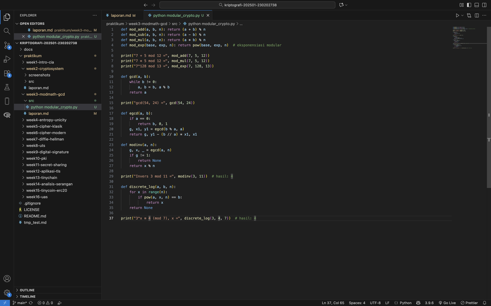
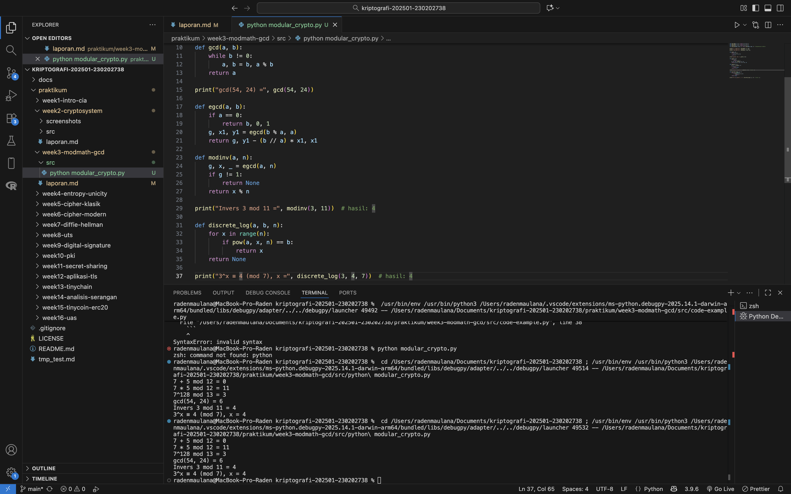

# Laporan Praktikum Kriptografi

Minggu ke-: 3
Topik: Aritmetika Modular, GCD, Bilangan Prima, Logaritma Diskrit  
Nama: Asmoko Khusnul Tri Maulana
NIM: 230202738
Kelas: 5IKRB

---

## 1. Tujuan

Setelah mengikuti praktikum ini, mahasiswa diharapkan mampu:

1. Menyelesaikan operasi aritmetika modular.
2. Menentukan bilangan prima dan menghitung GCD (Greatest Common Divisor).
3. Menerapkan logaritma diskrit sederhana dalam simulasi kriptografi.

---

## 2. Dasar Teori

Modular arithmetic adalah sistem perhitungan yang bekerja berdasarkan sisa hasil bagi suatu bilangan terhadap bilangan modulus tertentu. Dua bilangan dikatakan kongruen jika memiliki sisa pembagian yang sama terhadap modulus yang digunakan, ditulis sebagai
𝑎≡𝑏 (mod 𝑛) a≡b (modn). Konsep ini banyak digunakan dalam kriptografi karena memungkinkan operasi pada bilangan besar tetap efisien dan aman, serta menjadi dasar dari algoritma seperti RSA dan Diffie-Hellman.
Greatest Common Divisor (GCD) atau Faktor Persekutuan Terbesar adalah bilangan terbesar yang dapat membagi dua bilangan tanpa sisa. Perhitungannya umumnya dilakukan dengan Algoritma Euclidean yang cepat dan sederhana. Dalam kriptografi, GCD digunakan untuk memastikan dua bilangan bersifat relatif prima, sehingga memungkinkan perhitungan invers modular yang penting dalam pembentukan kunci publik dan privat pada sistem seperti RSA.

---

## 3. Alat dan Bahan

( - Python 3.12.2

- Visual Studio Code / editor lain
- Git dan akun GitHub  
  )

---

## 4. Langkah Percobaan

1. Membuat file baru bernama modular_crypto.py di dalam folder: `praktikum/week3-modular_math.md/src/`
2. Menyalin kode program dari panduan praktikum.
3. Menjalankan program dengan perintah `python modular_crypto.py`.)

---

## 5. Source Code

(Salin kode program utama yang dibuat atau dimodifikasi.  
Gunakan blok kode:

```
def mod_add(a, b, n): return (a + b) % n
def mod_sub(a, b, n): return (a - b) % n
def mod_mul(a, b, n): return (a * b) % n
def mod_exp(base, exp, n): return pow(base, exp, n)  # eksponensiasi modular

print("7 + 5 mod 12 =", mod_add(7, 5, 12))
print("7 * 5 mod 12 =", mod_mul(7, 5, 12))
print("7^128 mod 13 =", mod_exp(7, 128, 13))

def gcd(a, b):
    while b != 0:
        a, b = b, a % b
    return a

print("gcd(54, 24) =", gcd(54, 24))

def egcd(a, b):
    if a == 0:
        return b, 0, 1
    g, x1, y1 = egcd(b % a, a)
    return g, y1 - (b // a) * x1, x1

def modinv(a, n):
    g, x, _ = egcd(a, n)
    if g != 1:
        return None
    return x % n

print("Invers 3 mod 11 =", modinv(3, 11))  # hasil: 4

def discrete_log(a, b, n):
    for x in range(n):
        if pow(a, x, n) == b:
            return x
    return None

print("3^x ≡ 4 (mod 7), x =", discrete_log(3, 4, 7))  # hasil: 4
```

)

---

## 6. Hasil dan Pembahasan




)

---

## 7. Jawaban Pertanyaan

1. Peran aritmetika modular dalam kriptografi modern:
   Aritmetika modular berperan sebagai dasar utama dalam kriptografi modern karena digunakan untuk melakukan semua perhitungan enkripsi dan dekripsi pada bilangan yang sangat besar agar tetap berada dalam batas tertentu. Selain itu, aritmetika modular menciptakan fungsi satu arah yang mudah dihitung namun sulit dibalik, sehingga memberikan keamanan pada algoritma kriptografi seperti RSA, Diffie-Hellman, dan Elliptic Curve Cryptography (ECC).
2. Pentingnya invers modular dalam algoritma kunci publik (misalnya RSA):
   Invers modular sangat penting dalam algoritma kunci publik seperti RSA karena digunakan untuk menghitung kunci privat dari kunci publik. Dalam RSA, nilai
   d sebagai kunci privat diperoleh dari invers modular antara e (kunci publik) dan φ(n). Tanpa invers modular, proses dekripsi tidak dapat dilakukan karena tidak ada hubungan matematis yang mengembalikan pesan terenkripsi ke bentuk aslinya.
3. Tantangan utama dalam menyelesaikan logaritma diskrit untuk modulus besar:
   Tantangan utama dalam menyelesaikan logaritma diskrit untuk modulus besar adalah karena tidak adanya algoritma yang efisien untuk menghitungnya. Proses ini sangat sulit dan memerlukan waktu komputasi yang sangat lama ketika modulus berukuran besar. Kesulitan inilah yang menjadi dasar keamanan algoritma kriptografi seperti Diffie-Hellman dan DSA, karena membuat nilai eksponen pada operasi modular hampir mustahil ditemukan tanpa kunci yang benar.

---

## 8. Kesimpulan

Modular arithmetic dan GCD merupakan dua konsep dasar yang saling berkaitan dalam kriptografi modern. Modular arithmetic digunakan untuk melakukan operasi matematika dalam ruang bilangan terbatas yang menjadi dasar proses enkripsi dan dekripsi, sedangkan GCD memastikan bilangan-bilangan yang digunakan bersifat relatif prima agar invers modular dapat dihitung dengan benar. Kombinasi keduanya menjamin keamanan, efisiensi, dan keandalan dalam berbagai algoritma kriptografi seperti RSA dan Diffie-Hellman.

---

## 9. Daftar Pustaka

---

## 10. Commit Log

```
commit abc12345
Author: Asmoko Khusnul Tri Maulana <maulana.asmoko@gmail.com>
Date:   2025-11-13

    week3-modular_math: implementasi Aritmetika Modular, GCD, Bilangan Prima, Logaritma Diskri
```
