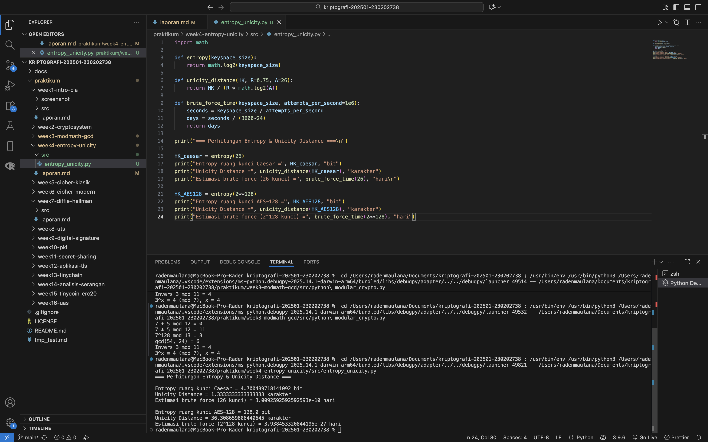

# Laporan Praktikum Kriptografi

Minggu ke-: 4  
Topik: Entropy & Unicity Distance (Evaluasi Kekuatan Kunci dan Brute Force)  
Nama: Asmoko Khusnul Tri Maulana  
 NIM: 230202738  
 Kelas: 5IKRB

---

## 1. Tujuan

1. Menyelesaikan perhitungan sederhana terkait entropi kunci.
2. Menggunakan teorema Euler pada contoh perhitungan modular & invers.
3. Menghitung **unicity distance** untuk ciphertext tertentu.
4. Menganalisis kekuatan kunci berdasarkan entropi dan unicity distance.
5. Mengevaluasi potensi serangan brute force pada kriptosistem sederhana.

---

## 2. Dasar Teori

Entropi (H(K)) merupakan ukuran ketidakpastian dari ruang kunci, yang menunjukkan seberapa sulit kunci tersebut ditebak. Semakin besar entropi, semakin aman sistem karena kemungkinan menebak kunci yang benar menjadi kecil. Entropi diukur dalam satuan bit dan dihitung menggunakan rumus 𝐻(𝐾) = log2 ∣𝐾∣, di mana ∣𝐾∣ adalah ukuran ruang kunci.

Unicity Distance (U) adalah jumlah minimum karakter ciphertext yang diperlukan agar hanya ada satu kunci yang masuk akal untuk mendekripsi pesan. Rumusnya adalah 𝑈 =𝐻(𝐾)𝑅⋅log2∣𝐴∣, dengan 𝑅 adalah redundansi bahasa dan ∣𝐴∣ ukuran alfabet. Nilai U yang rendah berarti cipher lebih mudah dipecahkan.

Brute Force Attack merupakan metode serangan paling dasar dalam kriptografi, yaitu mencoba setiap kemungkinan kunci sampai menemukan yang benar. Waktu yang diperlukan untuk brute force bergantung pada ukuran ruang kunci dan kecepatan komputer. Cipher sederhana seperti Caesar Cipher dapat dipecahkan dalam hitungan detik, sementara AES dengan 128-bit kunci membutuhkan waktu yang sangat lama bahkan dengan superkomputer modern.

---

## 3. Alat dan Bahan

(- Python 3.12.10

- Visual Studio Code / editor lain
- Git dan akun GitHub
- Library tambahan (math) )

---

## 4. Langkah Percobaan

(Tuliskan langkah yang dilakukan sesuai instruksi.  
Contoh format:

1. Membuat file `entropy_unicity.py` di folder `praktikum/week4-entropy-unicity/src/`.
2. Menyalin kode program dari panduan praktikum.
3. Menjalankan program dengan perintah `python entropy_unicity.py`.)

---

## 5. Source Code

(Salin kode program utama yang dibuat atau dimodifikasi.  
Gunakan blok kode:

```python
import math

def entropy(keyspace_size):
    return math.log2(keyspace_size)

def unicity_distance(HK, R=0.75, A=26):
    return HK / (R * math.log2(A))

def brute_force_time(keyspace_size, attempts_per_second=1e6):
    seconds = keyspace_size / attempts_per_second
    days = seconds / (3600*24)
    return days

print("=== Perhitungan Entropy & Unicity Distance ===\n")

HK_caesar = entropy(26)
print("Entropy ruang kunci Caesar =", HK_caesar, "bit")
print("Unicity Distance =", unicity_distance(HK_caesar), "karakter")
print("Estimasi brute force (26 kunci) =", brute_force_time(26), "hari\n")

HK_AES128 = entropy(2**128)
print("Entropy ruang kunci AES-128 =", HK_AES128, "bit")
print("Unicity Distance =", unicity_distance(HK_AES128), "karakter")
print("Estimasi brute force (2^128 kunci) =", brute_force_time(2**128), "hari")
```

)

---

## 6. Hasil dan Pembahasan

(- Lampirkan screenshot hasil eksekusi program (taruh di folder `screenshot/`).

- Berikan tabel atau ringkasan hasil uji jika diperlukan.
- Jelaskan apakah hasil sesuai ekspektasi.
- Bahas error (jika ada) dan solusinya.

Hasil eksekusi program Caesar Cipher:


)

---

## 7. Jawaban Pertanyaan

- Pertanyaan 1: Apa arti dari nilai entropy dalam konteks kekuatan kunci?
  Jawab: Entropy menunjukkan seberapa acak atau tidak terduganya kunci. Semakin besar nilai entropy, semakin sulit kunci ditebak, sehingga sistem lebih aman.
- Pertanyaan 2: Mengapa unicity distance penting dalam menentukan keamanan suatu cipher?
  Jawab: Karena unicity distance menggambarkan jumlah ciphertext yang diperlukan agar kunci dapat diidentifikasi secara unik. Jika nilai ini kecil, cipher mudah diserang karena sedikit ciphertext sudah cukup untuk menentukan kunci.
- Pertanyaan 3: Mengapa brute force masih menjadi ancaman meskipun algoritma sudah kuat?
  Jawab: Karena brute force tetap relevan bila implementasi lemah, kunci terlalu pendek, atau sistem menggunakan kata sandi yang mudah ditebak. Perkembangan teknologi juga terus meningkatkan kemampuan komputasi, membuat brute force semakin cepat.

---

## 8. Kesimpulan

Dari percobaan, dapat disimpulkan bahwa nilai entropi dan unicity distance berbanding lurus dengan kekuatan sistem kriptografi. Cipher sederhana seperti Caesar sangat rentan karena entropinya rendah, sedangkan AES-128 memiliki entropi tinggi dan tidak dapat dipecahkan dengan brute force menggunakan teknologi saat ini.

---

## 9. Daftar Pustaka

---

## 10. Commit Log

```
commit 0dfc99ddc847a60a3bd05bab32e0f5cd8ba8c034
Author: Asmoko Khusnul Tri Maulana <maulana.asmoko@gmail.com>
Date:   2025-11-13

    week4-entropy-unicity
```
